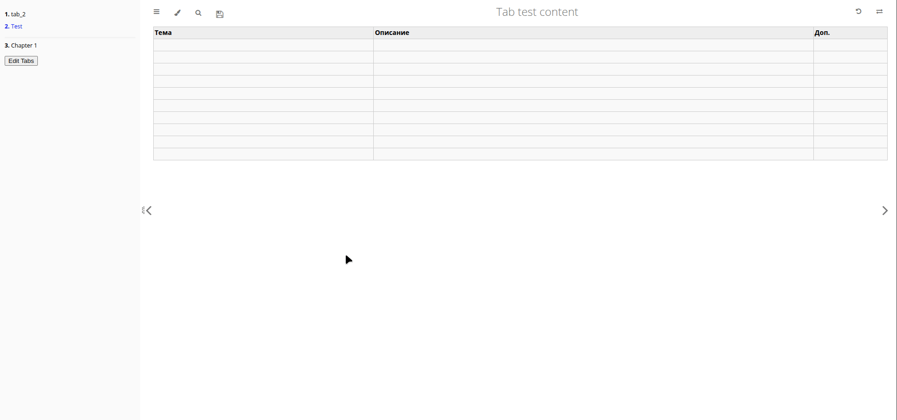
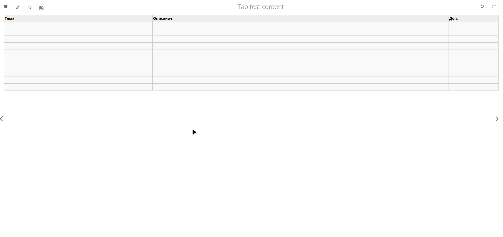

# Snipet stash


**Snipet stash** - это хранилище кодовых заметок в табличной форме. 

Идея возникла как вариант более удобного использования `Google Sheets`, который имеет структуру таблицы но не имеет подсветки синтаксиса. Вариант с форматом Makrdown (`mdbook`) значительно лучше для форматирования кода, и возможность применения `Javascript` расширяет гибкость пользовательского взаимодействия. 

<details>

<summary>en</summary>

**Snippet Stash** is a code snippet storage system designed to serve as a personal reference or knowledge base.
The idea was born out of the need for proper syntax highlighting (which was missing in Google Sheets) and the advantages provided by `mdBook`.

</details>

## Preview

<details>

<summary>Скриншоты, гифки или диаграммы, которые иллюстрируют интерфейс или архитектуру.</summary>



</details>

<details>

<summary>Скриншоты, гифки или диаграммы, которые иллюстрируют интерфейс или архитектуру.</summary>



</details>

Онлайн редактирование контента сохраняется в `localStorage` браузере пользователя. При сохранении изменений выполняется запрос на Github через Github API и инициируется CI/CD сборка с запуском скриптов изменения makrdown файлов репозитория. Таким образом реализовано добавление новый страниц, ячеек таблиц, добавления картинок.

Для ускорения времени сборки, исполняемые файлы, такие как: `bin/mdbook`, `bin/editor-md`, `bin/mdbook-include-md` предварительно скомпилированы. 

Удаление страниц `tab` и картинок не поддерживается через WEB

<details>

<summary>en</summary>

This project allows **live editing of HTML content directly in the browser**. Changes are saved locally, and when saved explicitly, a GitHub API request is triggered. This initiates a CI/CD pipeline that runs scripts to update Markdown files and image assets in the repository. This enables:

* Adding new pages
* Inserting new table rows (`<tr>`)
* Uploading and embedding images

To improve build performance, all executable tools (`bin/mdbook`, `bin/editor-md`, `bin/mdbook-include-md`) are precompiled in required versions and reused across builds.

> ⚠️ **Note:** Deleting `tab` pages and images is not supported via WEB
</details>


## Features

- Подсветка синтаксиса кода
- Выполнение кода на языке Rust, Python
- Makrdown форматирование заметок 
- Поиск по заметкам
- Статический сайт
- Новые разделы `tab` создаются после редактирования структуры в файле `src/SUMMARY.md`
- Mermaid диаграммы

<details>

<summary>en</summary>

* Syntax highlighting for code snippets
* Code execution support (Rust and Python)
* Markdown-based note formatting
* Full-text search across notes
* Static website generation with `mdBook`
* New `tab` sections are created after editing the structure in the `src/SUMMARY.md` file
* Mermaid Diagramming
</details>

### Оформление кода
- Оформление кода в HTML 

```html
<pre><code class="language-python"> 
def print_person(name, age = 18):
    print(f"Name: {name}  Age: {age}")
print_person("Bob")
</code></pre>
```

- Оформление кода в Markdown 

```code
line break
line break
```rust
fn main() {
    println!("Hello, world!");
}
line break
```

## Установка

- Склонировать, удалить содержимое папок `src/tabs`, `src/images`.
- В файле `book.toml` поменять `output.html.site-url`.
- В файле `src/js/general.js` поменять константы репозитория (`owner,repo,branch`).
  - вариант горячей замены констант при сборке книги, использовать preprocessor `cmdrun` (`[preprocessor.cmdrun] after = ["include-md"]`), в каждом `src/tabs/.../index.md` добавить в javascript команду: `<!-- cmdrun cat ../../config/setting.js -->`. В этом файле установить константы `window.repo='...'; ...`
- Редактировать файл `src/SUMMARY.md`
- Создать [personal-access-tokens](https://github.com/settings/personal-access-tokens/new) к своему репозиторию
- Выполнить `make`, для запуска CI/CD создания `GitHub Page`

⚠️ **Note:** Версии `bin/mdbook v0.4.51`, `bin/mdbook-mermaid v0.15.0`, `bin/mdbook-graphviz v0.2.1`

---
## Resources

[mdBook doc](https://docs.rs/mdbook/latest/mdbook/preprocess/struct.CmdPreprocessor.html)

[mdBook Preprocessors](https://github.com/rust-lang/mdBook/wiki/Third-party-plugins)

[zola альтернатива mdBook](https://www.getzola.org/documentation/getting-started/overview/) 

[build mdBook](https://rust-lang.github.io/mdBook/cli/build.html)
 
[mdBook Markdown](https://rust-lang.github.io/mdBook/format/markdown.html)

[highlight.js doc](https://highlightjs.readthedocs.io/en/latest/api.html#configure)

[Icons Font Awesome 4](https://fontawesome.com/v4/icons/)

[Mermaid Diagramming](http://mermaid.js.org/)

[Mermaid Diagramming xyChart](http://mermaid.js.org/syntax/xyChart.html)

[Mermaid Diagramming Playground](https://www.mermaidchart.com/play?utm_source=mermaid_live_editor&utm_medium=toggle#pako:eNpdkMFOw0AMRH_Fyik5IO4VQmq5glqVcuvF3Tgbi8RevLuVUsS_k5KmQH3zm_Fo5M_CaU3FouhZ6h7DXgBMNZXlBVTVGQGsjT1LnBaAZxUPLcekNsxssWCnUjYIDd4dVN-rWdloyB0anzCxykwBVsaJYwth0iHEwbXaqR8Ac2rVYKcywCqf8HK1pUhorp0z1gLUNOQSH0koxoeD3T-i1NAQpmwU_xiXOWk_NnDgjG6avMVf6zRPP54jQSLXCn_kW8NrMkzkx7jQoQiL_68vzeeeJMH4xXBVd6rdNWhDAueyAQPZDF_IeuR6L8XXN7kLgpw)

[Graphviz Diagramming](https://graphviz.org/Gallery/directed/), [Layout Dot pdf](https://graphviz.org/pdf/dotguide.pdf), 
[A Network Map. Layout twopi](https://graphviz.org/Gallery/twopi/twopi2.html), [Mind map of Happiness. Layout twopi](https://graphviz.org/Gallery/twopi/happiness.html)

[Graphviz Visual Editor Playground](https://magjac.com/graphviz-visual-editor/)