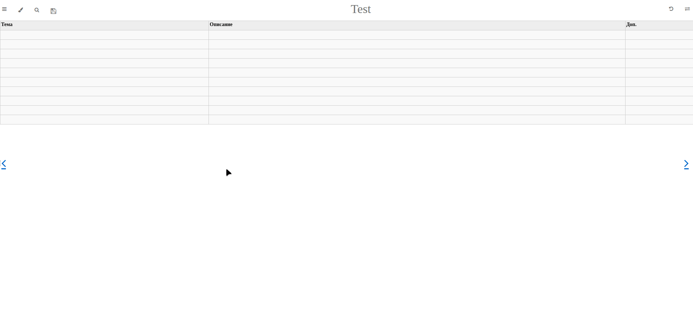
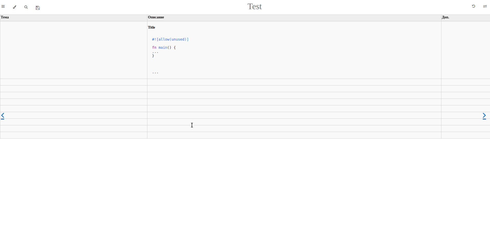
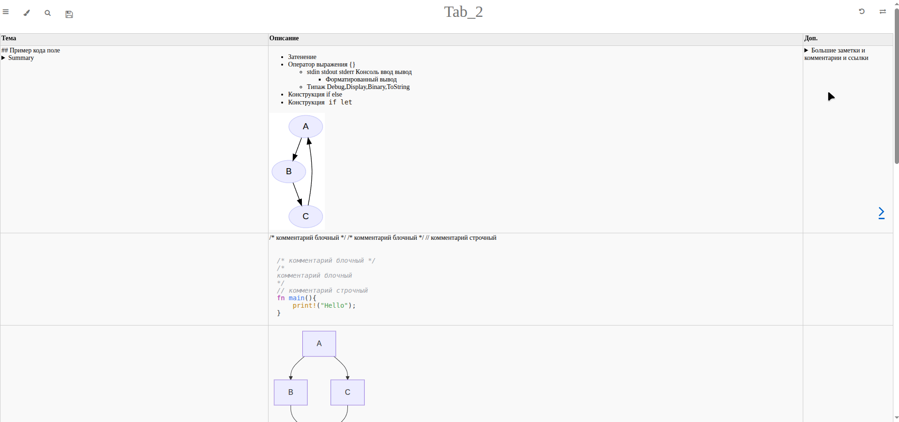
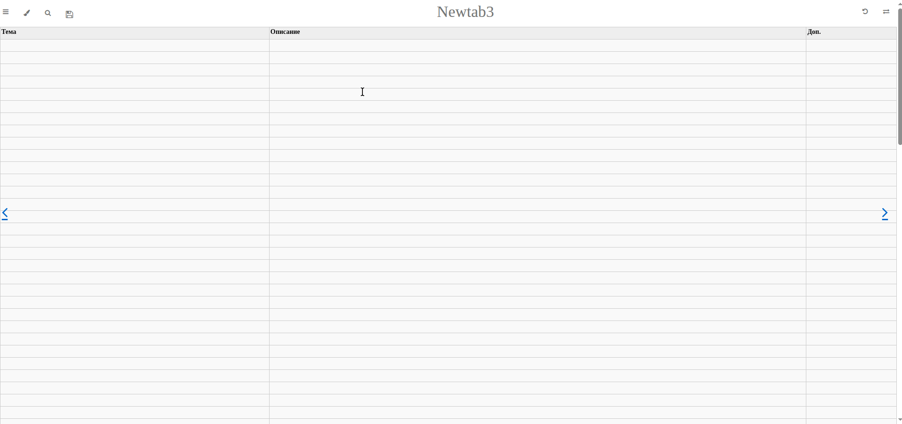

# Snipet stash


**Snipet stash** - это хранилище кодовых заметок в табличной форме. 

Идея возникла как вариант более удобного использования `Google Sheets`, который имеет структуру таблицы, но не имеет подсветки синтаксиса. Вариант с форматом Markdown (`mdbook`) значительно лучше для форматирования кода, и возможность применения `Javascript` позволяет пользователю взаимодействовать с контентом.

Сайт представляет собой статически сгенерированные страницы и размещается через GitHub Pages.
Это удобно для публичных заметок — все файлы доступны напрямую.

Если вы хотите хранить приватные заметки, вам потребуется либо:
- платный GitHub-аккаунт с приватным репозиторием и включённым GitHub Pages;
- либо расширить CI/CD-пайплайн и настроить деплой на собственный сервер или хостинг.

[Show Actions Linux (Usage breakdown)](https://github.com/settings/billing/usage?period=3&group=4&customer=14034757)

<details>
<summary>en</summary>

**Snippet Stash** is a code snippet storage system designed to serve as a personal reference or knowledge base.  
The idea was born out of the need for proper syntax highlighting (which was missing in Google Sheets) and the advantages provided by `mdBook`.

The site is a static website hosted via GitHub Pages.
This is ideal for public notes, as all files are openly accessible.

If you want to keep your notes private, you’ll need either:

- a paid GitHub account with a private repository and GitHub Pages enabled;
- or extend the CI/CD pipeline to deploy the site to your own server or hosting provider.
</details>


## Preview

**Скриншоты, гифки или диаграммы, которые иллюстрируют интерфейс или архитектуру.**

<details>

<summary>Features</summary>



</details>

<details>

<summary>Create Tabs</summary>

```
⚠️ Important! Path format:

- [NAME YOUR TAB](./tabs/<NEW_TAB_ID>/index.md)
```



</details>

<details>

<summary>Formatting cells</summary>



</details>

<details>

<summary>Matplotlib: Visualization with Python.</summary>



</details>


Онлайн редактирование контента сохраняется в `localStorage` браузера пользователя. При сохранении изменений выполняется запрос на GitHub через GitHub API и инициируется CI/CD сборка с запуском скриптов изменения markdown-файлов репозитория. Таким образом реализовано добавление новых страниц, ячеек таблиц, загрузка изображений.

Для ускорения времени сборки, исполняемые файлы, такие как: `bin/mdbook`, `bin/editor-md`, `bin/mdbook-include-md`, `bin/mdbook-graphviz`, `bin/mdbook-mermaid` — предварительно скомпилированы.

Удаление страниц `tab` и картинок не поддерживается через WEB.

<details>
<summary>en</summary>

This project allows **live editing of HTML content directly in the browser**. Changes are saved locally, and when saved explicitly, a GitHub API request is triggered. This initiates a CI/CD pipeline that runs scripts to update Markdown files and image assets in the repository. This enables:

* Adding new pages  
* Inserting new table rows (`<tr>`)  
* Uploading and embedding images  

To improve build performance, all executable tools (`bin/mdbook`, `bin/editor-md`, `bin/mdbook-include-md`, `bin/mdbook-graphviz`, `bin/mdbook-mermaid`) are precompiled in required versions and reused across builds.

> ⚠️ **Note:** Deleting `tab` pages and images is not supported via WEB.

</details>


## Features

- Подсветка синтаксиса кода
- Выполнение кода на языке Rust, Python
- Mermaid диаграммы
- Graphviz диаграммы
- Matplotlib графики
- Makrdown форматирование заметок 
- Поиск по заметкам
- Статический сайт
- Новые разделы `tab` создаются после редактирования структуры `src/SUMMARY.md` через WEB


<details>

<summary>en</summary>

* Syntax highlighting for code snippets
* Code execution support (Rust and Python)
* Markdown-based note formatting
* Matplotlib charts
* Full-text search across notes
* Static website generation with `mdBook`
* New `tab` sections are created after editing the `src/SUMMARY.md` structure via WEB
* Mermaid Diagramming
* Graphviz Diagramming
</details>

### Оформление кода
- Оформление кода в HTML 

```html
<pre><code class="language-python"> 
def print_person(name, age = 18):
    print(f"Name: {name}  Age: {age}")
print_person("Bob")
</code></pre>
```


## Как устроен CI/CD на GitHub Actions

Workflow, описанный в `.github/workflows/mdbook.yml`, запускается при событии `push` в ветку `main`.

Процесс сборки занимает около 25–35 секунд благодаря использованию предварительно собранных исполняемых файлов. Поскольку работа с заметками не требует частых коммитов, обычно инициация push (то бишь нажимать сохранить) происходит лишь по окончанию работы и ожидать минуту для завершения сборки новой версии не придется. Исключение составляет загрузка изображений: так как сайт работает без сервера, изображения отправляются сразу после выбора и загружаются в репозиторий через GitHub API, это автоматически запускает GitHub Actions Workflow.

Во время выполнения Workflow запускаются скрипты `copy_raw_other_files.sh` и `execute_editor_commands.sh`, которые изменяют содержимое файлов и директорий в репозитории. Это может привести к дополнительному внутреннему push от CI-бота.


<details>

<summary>How GitHub Actions CI/CD Works</summary>

The workflow defined in `.github/workflows/mdbook.yml` is triggered by a `push` event to the `main` branch.

The build process takes approximately 25–35 seconds, thanks to the use of precompiled binaries. Since working with notes doesn't require frequent commits, pushes (i.e. saving changes) are usually done only at the end of a session, so there’s no need to wait for a full minute while a new version is built.

An exception is image uploads: because the site is serverless, images are uploaded immediately after selection and pushed to the repository via the GitHub API. This automatically triggers the GitHub Actions workflow.

During workflow execution, the scripts `copy_raw_other_files.sh` and `execute_editor_commands.sh` are run. These modify the contents of files and directories in the repository, which may result in an additional internal push by the CI bot.

</details>


## Установка

- Склонировать, удалить содержимое папок `src/tabs`, `src/images`.
- В файле `book.toml` поменять `output.html.site-url`.
- В файле `src/js/general.js` поменять константы репозитория (`owner,repo,branch`).
- Редактировать файл `src/SUMMARY.md`
- Создать [personal-access-tokens](https://github.com/settings/personal-access-tokens/new) к своему репозиторию
- Выполнить `make`, для запуска CI/CD создания `GitHub Page`

⚠️ **Note:** Версии программ:
- `bin/mdbook v0.4.51`
- `bin/mdbook-mermaid v0.15.0`
- `bin/mdbook-graphviz v0.2.1`


<details>

<summary>Install</summary>

* Clone the repository and delete the contents of the `src/tabs` and `src/images` folders.
* In the `book.toml` file, update the `output.html.site-url` value.
* In `src/js/general.js`, update the repository constants (`owner`, `repo`, `branch`).
* Edit the `src/SUMMARY.md` file as needed.
* Create a [personal access token](https://github.com/settings/personal-access-tokens/new) for your repository.
* Run `make` to trigger the CI/CD process and deploy the GitHub Page.

⚠️ **Note:** Required tool versions:

* `bin/mdbook v0.4.51`
* `bin/mdbook-mermaid v0.15.0`
* `bin/mdbook-graphviz v0.2.1`


</details>


## Resources

- [mdBook doc](https://docs.rs/mdbook/latest/mdbook/preprocess/struct.CmdPreprocessor.html)
- [mdBook Preprocessors](https://github.com/rust-lang/mdBook/wiki/Third-party-plugins)
- [zola альтернатива mdBook](https://www.getzola.org/documentation/getting-started/overview/) 
- [build mdBook](https://rust-lang.github.io/mdBook/cli/build.html)
- [mdBook Markdown](https://rust-lang.github.io/mdBook/format/markdown.html)
- [highlight.js doc](https://highlightjs.readthedocs.io/en/latest/api.html#configure)
- [Icons Font Awesome 4](https://fontawesome.com/v4/icons/)
- [Mermaid Diagramming](http://mermaid.js.org/)
  - [Mermaid Diagramming xyChart](http://mermaid.js.org/syntax/xyChart.html)
  - [Mermaid Diagramming Playground](https://www.mermaidchart.com/play?utm_source=mermaid_live_editor&utm_medium=toggle#pako:eNpdkMFOw0AMRH_Fyik5IO4VQmq5glqVcuvF3Tgbi8RevLuVUsS_k5KmQH3zm_Fo5M_CaU3FouhZ6h7DXgBMNZXlBVTVGQGsjT1LnBaAZxUPLcekNsxssWCnUjYIDd4dVN-rWdloyB0anzCxykwBVsaJYwth0iHEwbXaqR8Ac2rVYKcywCqf8HK1pUhorp0z1gLUNOQSH0koxoeD3T-i1NAQpmwU_xiXOWk_NnDgjG6avMVf6zRPP54jQSLXCn_kW8NrMkzkx7jQoQiL_68vzeeeJMH4xXBVd6rdNWhDAueyAQPZDF_IeuR6L8XXN7kLgpw)
- [Graphviz Diagramming](https://graphviz.org/Gallery/directed/), 
  - [Layout Dot pdf](https://graphviz.org/pdf/dotguide.pdf), 
  - [A Network Map. Layout twopi](https://graphviz.org/Gallery/twopi/twopi2.html), 
  - [Mind map of Happiness. Layout twopi](https://graphviz.org/Gallery/twopi/happiness.html)
  - [Graphviz Visual Editor Playground](https://magjac.com/graphviz-visual-editor/)
- [Matplotlib](https://matplotlib.org/)