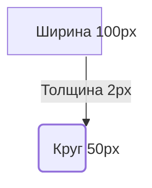
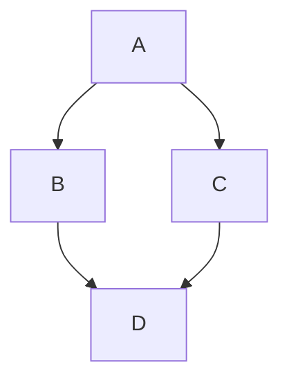
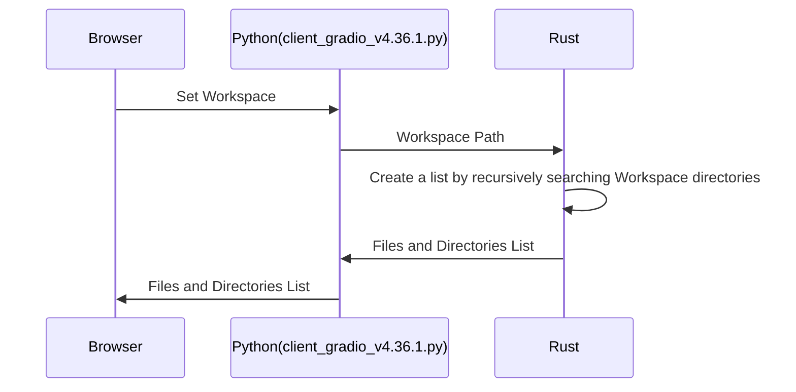

# Chapter 1

# Example heading { #first .class1 .class2 }

<div>
   <button id="hint_on_theory">Подсказка по теории</button>
</div>

<div>
   <button id="execution_by_code">Выполнение кода https://glot.io</button>
</div>


[Ссылка на tab_1 главу](/tabs/tab_1/index.md)


<i class="fa fa-spinner fa-pulse fa-5x fa-fw"><span class="sr-only">Loading...</span></i>

<i class="fa fa-save fa-pulse fa-2x"></i>

<i class="fa fa-bars fa-3x" aria-hidden="true"></i>

<div class="btn-group">
    <a class="btn btn-default" href="#">
        <i class="fa fa-align-justify" title="Align Justify"></i>
    </a>
</div>

<i class="fa fa-th" aria-hidden="true"></i>

<i class="fa fa-file" aria-hidden="true"></i>

<i class="fa fa-minus-square" aria-hidden="true"></i>

<i class="fa fa-hand-o-down" aria-hidden="true"></i>

<a class="btn btn-default" href="#"><i class="fa fa-hand-o-up" aria-hidden="true"></i></a>


## Latex

$${\color{red}Red}$$

$${\color{green}Green}$$

$${\color{lightgreen}Light \space Green}$$


| Left-aligned | Center-aligned | Right-aligned |
| :---               |     :---:               |                  ---: |
| git status     | git status          | git status        |
| git diff          | git diff               | git diff             |


 
## mermaid 

 





 
<div class="mermaid">
graph TD
    A --> B
</div>




## Markdown javascript

```javascript
// javascript codeblock
    setTimeout(() => {
        console.log(1 + 2);
        console.log(document.getElementById("hint_on_theory").innerText);
    }, 1000);

```

## HTML javascript

<pre><code class="language-javascript"> 
    // javascript codeblock
    setTimeout(() => {
        console.log(1 + 2);
        console.log(document.getElementById("hint_on_theory").innerText);
    }, 1000);
</code></pre>

---

## Markdown python

```python
# python codeblock
def print_person(name, age = 18):
    print(f"Name: {name}  Age: {age}")
print_person("Bob")

```

## HTML python

<pre><code class="language-python"> 
# python codeblock
def print_person(name, age = 18):
    print(f"Name: {name}  Age: {age}")
print_person("Bob")
</code></pre>

---

 

## Markdown C

```c
#include <stdio.h>
int main() { printf("Hello WASI!"); return 0; }
```

## HTML C

<pre><code class="language-c"> 
#include <stdio.h>
int main() { printf("Hello WASI!"); return 1; }
</code></pre>

---

$$ 
\int_0^\infty e^{-x^2} dx = \frac{\sqrt{\pi}}{2}
$$
 
<script>
document.addEventListener('DOMContentLoaded', async () => {
    try {
       
        document.getElementById('hint_on_theory').addEventListener('click', function() {
            const token = prompt("токен:");
            if (!token) {
                console.error("Ошибка: Заполните поля token");
                return;
            }

            console.log('hint_on_theory');
        
        
        });

        document.getElementById('execution_by_code').addEventListener('click', function() {
            const token = prompt("токен:");
            if (!token) {
                console.error("Ошибка: Заполните поля token");
                return;
            }

            console.log('execution_by_code');
        
            fetch('https://glot.io/api/run', {
                method: 'POST',
                headers: {
                    'Content-Type': 'application/json',
                    'Authorization': `Token ${token}` 
                },
                body: JSON.stringify({
                    language: 'python',
                    files: [
                    { name: 'main.py', content: 'print("Hello from Glot.io!")' }
                    ]
                })
             })
            .then(response => response.json())
            .then(data => console.log(data))
            .catch(error => console.error('Error:', error));
        });


    } catch (error) {
        console.error("Error:", error);
    }
});
</script> 
